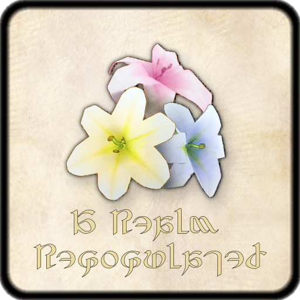

  
# A Realm Repopulated

A Dalamud plugin for custom NPC scenarios and interactions in Final Fantasy XIV

## Main Points

This plugin aims to enhance the gameplay experience in Final Fantasy XIV by providing the player with the ability to create custom npc scenarios and interactions. It allows users to repopulate the game world with unique characters, quests, and dialogues, enriching the overall immersion and enjoyment of the game.

## Restrictions

The plugin is intended for client side only interactions and does not modify any server-side data. It is designed to be aligned (in the broader sense) with the terms of service of Final Fantasy XIV and does not facilitate cheating or unfair advantages in multiplayer aspects of the game.

## Contributing
Contributions to the project are welcome. If you have ideas for new features, improvements, or bug fixes, please feel free to submit a pull request or open an issue.
